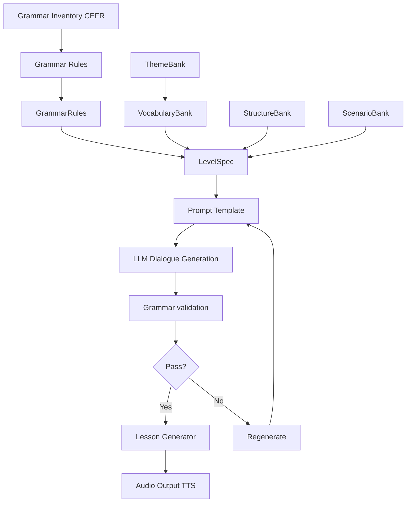

# Arabic Listening AI App - Design Document

## 1. Vision and Problem Statement
Many language learning apps require constant interaction with a phone. We as the modern humans are already using our phones too much with deleterious effects on our posture and muscleloskeletal health. The goal of a relaxed language learning should be to learn a language while minimizing phone interaction such as by listening and repeating a series of phrases during a leisurely walk. Listening sessions ideally be grouped into seasons and accompanied by a reading companion booklet.
## 2. Target Users
We target people who are at A2 level and above in their arabic journey, and now looking for additional listen and repeat style of learning.
## 3. User Journey
The user is shown a series of lessons organized by level and seasons. They pick a level and then they pick their first lesson within a season. The lessons get progressively more complex and each lesson introduces new vocabulary. 

The outline of a lesson is something like this:
- Listen to a conversation or a story, probably containing a few new phrases and vocabulary.
- Listen and repeat these new phrases and vocabulary. Learn their english meaning.
- Finally listen to the conversation again and undersand it much better this time.

In order to keep the user engaged, the lessons involve similar characters and story archs.
## 4. MVP Scope
0. Phase 0:
- Produce a single lesson by manually entering vocabulary, grammar and a scenario. The point is too optimize the prompt. 
1. Phase I:
- Produce several lessons without any story archs.
- Produce 10 to 30 audio files to be listened. 
2. Phase II:
Build and release an app in order to sell these lessons to the paying users. 
3. Phase III:
Produce companion booklets for easy practice in evenings. Each season should be accompanied by a booklet.
## 5. Big picture AI Architecture
### Architecture I

##### Grammar Inventory:
The grammar inventory is a comprehensive collection of grammatical structures and topics categorized by difficulty levels. It serves as a reference for selecting appropriate grammatical constructs for dialogue generation, ensuring that the generated content is suitable for the target proficiency level of the learners. Topics will be extracted from the following sources:
Al‑Kitaab fii Taʿallum al‑ʿArabiyya
Al‑ʿArabiyyah Bayna Yadayk
Madinah Arabic Course
Mastering Arabic
##### Vocabulary Bank:
The vocabulary bank is a curated collection of words and phrases categorized by difficulty levels. Difficulty level is determined by frequency of occurance in the corpora. These frequencies match the CEFR levels. Difficulty levels are roughly based on the following criteria (to be refined):
Top 1000 words → A1
Top 2000 words → A2
Top 4000 words → B1
Top 7000 words → B2
##### Grammar Rules:
Grammar rules define how the grammatical structures from the inventory can be combined and used in sentences. They provide the syntactic and morphological guidelines for constructing grammatically correct sentences in Arabic. These rules will be based on the folowing sources:
Ryding — A Reference Grammar of Modern Standard Arabic
Alhawary — Modern Standard Arabic Grammar
##### Structure Bank:
Structure A:
Greeting
Question
Answer
Follow-up question
Explanation
Closing

Structure B:
Problem statement
Clarification question
Explanation
Suggestion
Agreement

Structure C:
Invitation
Refusal
Reason
Counter-offer
Acceptance

###### Discovering Conversational Structures

Conversational structures used to generate dialogues can be derived from linguistic research and empirical observation of real conversations. The goal is to identify common interaction patterns that occur naturally in everyday speech and represent them as reusable templates for dialogue generation.

1. Dialogue Act Frameworks

Linguistic frameworks such as Speech Act Theory and Dialogue Act taxonomies classify utterances by their communicative function (e.g., question, request, refusal, apology). By analyzing common sequences of these acts, reusable conversational templates can be created (e.g., request → refusal → justification → negotiation → agreement).

2. Conversation Analysis

Conversation analysis research studies how people organize interactions. Common patterns such as greeting exchanges, problem–solution sequences, invitations, complaints, and storytelling can be abstracted into dialogue structures suitable for generation.

3. Analysis of Real Dialogue Corpora

Annotated dialogue datasets and conversational transcripts can be analyzed to identify frequently occurring sequences of dialogue acts. These sequences provide empirical templates for conversational flow.

4. Extraction from Natural Media

Scripts or transcripts from natural conversations (e.g., interviews, subtitles, podcasts) can be analyzed to identify recurring conversational patterns. The focus is on extracting interaction structure, not specific wording.

##### Scenario Bank

The Scenario Bank is a curated collection of realistic communicative contexts used to ground lesson generation in believable everyday situations. While the Structure Bank captures how a conversation unfolds at the interaction level (for example, question → answer → clarification, or invitation → refusal → counter-offer), the Scenario Bank captures what is happening in the world: who is speaking, where they are, what they are trying to accomplish, and under what circumstances the dialogue takes place. In this sense, the Scenario Bank provides the contextual layer for dialogue generation, ensuring that lessons are not only grammatically correct and level-appropriate, but also situated in useful, natural, and pedagogically meaningful settings. This fits the broader lesson design in which the learner listens to a short conversation or story, practices key phrases, and then listens again with improved understanding, while the architecture already treats reusable “banks” as inputs to dialogue generation.

Each entry in the Scenario Bank should contain enough information to define a context, not just a topic label. At minimum, a scenario should specify the communicative goal (such as meeting someone, asking directions, making a request, solving a problem, or declining an invitation), the setting (street, café, home, classroom, office, shop, station, phone call, and so on), the participants and their relationship (friends, strangers, classmates, coworkers, family members), the topic domain (travel, food, study, work, daily life, health, social plans), and the situational conditions that make the exchange realistic, such as time of day, season, urgency, misunderstanding, or mild social tension. Scenario entries may also include metadata such as CEFR suitability, vocabulary domains, compatible grammar targets, likely emotional tone, and compatible conversational structures. This allows the scenario engine to choose contexts that naturally express the lesson’s grammar and vocabulary goals, rather than generating abstract dialogue disconnected from real use.

The Scenario Bank should be constructed as a taxonomy of reusable scenario templates, not as an attempt to list every possible life situation. A practical approach is to build it from a small number of dimensions that can be recombined: domain of life, communicative goal, setting, participant roles, topic bundle, and optional complication. For example, “asking directions” can appear in multiple settings, involve different participant relationships, and include different complications such as not understanding the first answer or being in a hurry. By organizing scenarios in this compositional way, the bank can support a large repertoire of lesson contexts without requiring thousands of hand-authored scenes. The result is a scalable system in which each lesson can be grounded in a realistic scenario while still remaining flexible, level-controlled, and focused on language learning rather than on maintaining long-form narrative continuity.
## 6. System Architecture
## 7. Data Model
## 8. Risks and Tradeoffs
## 9. Open Questions